# DB_LAB2

In fig 1. I introduced the name of my database, changed the location of my database
in MyDocuments/Data file which was created by me, changed the limit of increament by 100
MB and increament by 5 MB of the primary file and of the logo by 1000 MB and 20 MB.

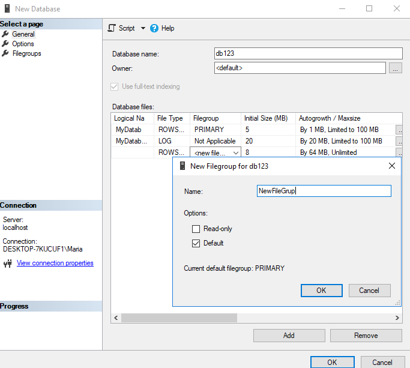

I showed the new Filegroup I created for secondary files, it’s increament is
seted as 10 MB and limit as 1000 MB.

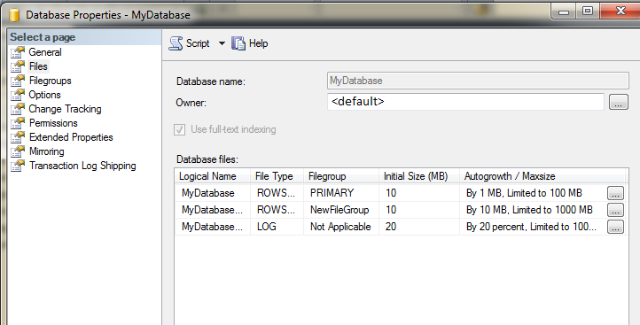

# TASK2

I changed the location of the log file into MyDocuments/Log map which I created

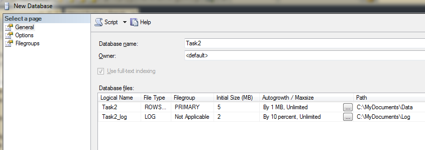

 I seted that my database to be compatible with MS SQL Server 2014.
 
 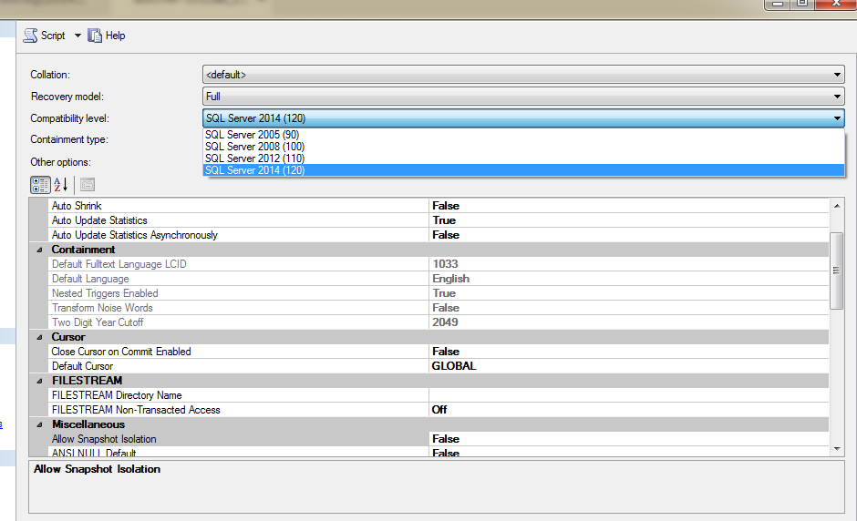
 
 
  I started to create the Maintenance Plan for first database. I seted that this
operation should rule each friday at 02:00.

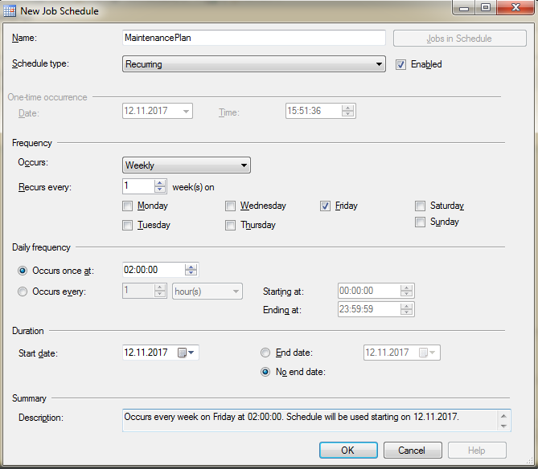

Shrink Database reduces the disk space consumed by the database and log files
removing empty data and log pages

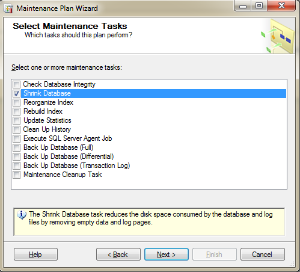

I chose the first database.

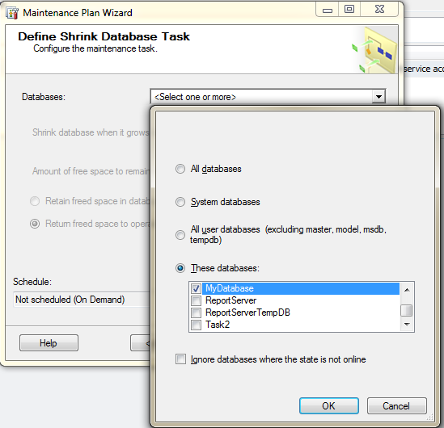

I configure the maintenance, when it grows beyond 2000 MB, and amount of
free space to remain after shrink operation as 10 (percent), and Return freed space to operating
system.

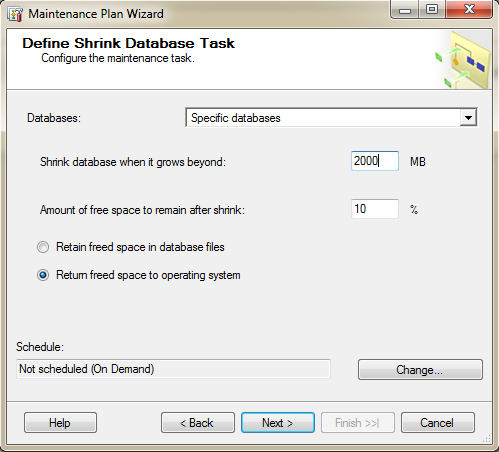

Here  is shown the maintanance plan

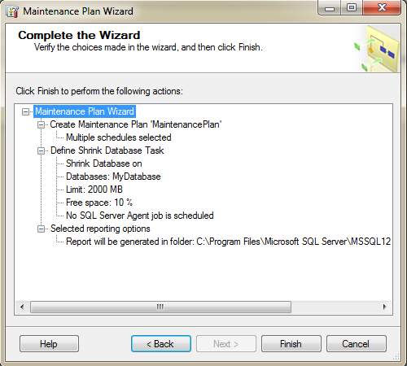

# Task4 

 I created another plan named Reconstruction Index. So, with this plan we will
increase our database performence by cleaning some not necsesary things. We chosed Monthly
period every first week on Sunday.

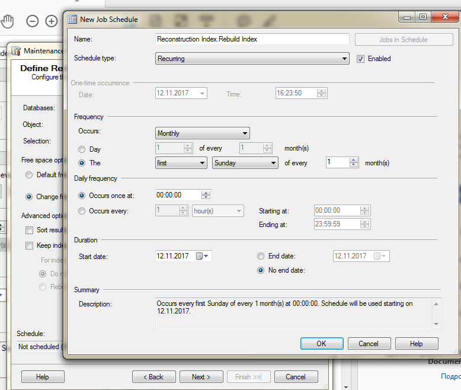

Here we selected the second Task database and all Views. We want at
least 10 percent, free speace here. And we want to do some cleaning here which history older
than 6 weeks will be deleted on first sunday on month.

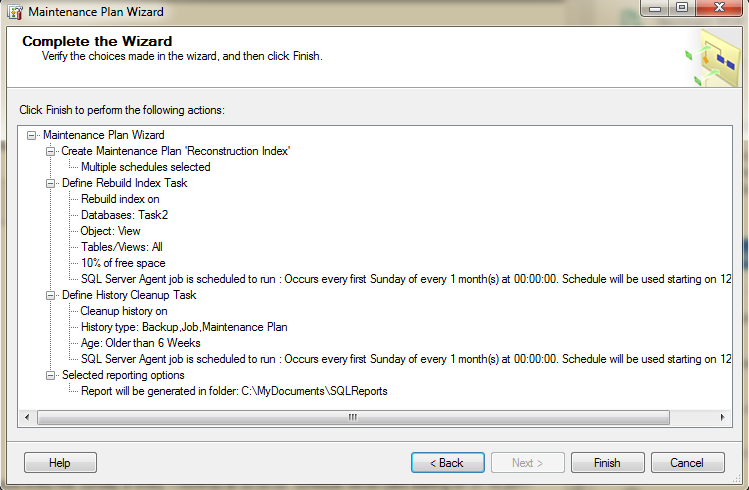

# Conclusion:

  After completing the required tasks i gathered basic knowledge regarding the database creation
and its maintenance through maintenance plans. I learned the specifics and files available for
the database and the functions included in the maintenance plan like the database shrinking,
backingup, deleting history and saving logs to a certain directory on certain times for future
reviewing.

# Bibliography:

• Microsoft SQL Server 2014 Pas cu Pas - Vitalie Cotelea , Marian Cotelea
