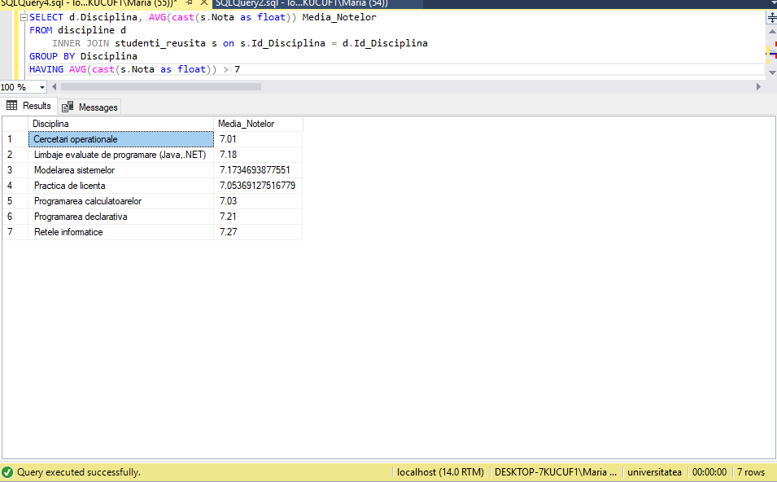

# Laborator 4


### Interogarea nr8.
```
Select distinct studenti.Id_Student, Nume_Student
FROM studenti INNER JOIN studenti_reusita ON studenti.Id_Student=studenti.Id_Student
Where year(Data_Evaluare)=2018
```

_**Obtineti identificatorii si numele studentilor, ale examenelor sustinute in anul 2018.**_


### Interogarea nr14
    Select Nume_Student, Prenume_Student, Disciplina, Nota
    FROM studenti 
    INNER JOIN studenti_reusita ON studenti.Id_Student=studenti.Id_Student
    INNER JOIN discipline ON studenti_reusita.Id_Disciplina=discipline.Id_Disciplina
    Where Nota>8

_**Aflati numele si prenumele studentilor, precum si cursurile promovate cu note mai mari de 8 la
examen.**_ 


### Interogarea nr29

_**Determinati numele si prenumele studentilor, care au sustinut examene cu o nota mai mica decat
oricare dintre notele studentilor cu identificatorul 1 00.**_

```
Select distinct Nume_Student, Prenume_Student, Nota
From studenti, studenti_reusita
Where studenti.Id_Student=studenti_reusita.Id_Student and Nota < Any (select Nota 
From studenti_reusita 
where Id_Student=100)
```


### Interogarea nr35
_**Găsiți denumirile disciplinelor și media notelor pe disciplină. Afișați numai disciplinile cu medii mai mari de 7,0**_

`
SELECT d.Disciplina, AVG(cast(s.Nota as float)) Media_Notelor 
FROM discipline d
	INNER JOIN studenti_reusita s on s.Id_Disciplina = d.Id_Disciplina
GROUP BY Disciplina
HAVING AVG(cast(s.Nota as float)) > 7
`




