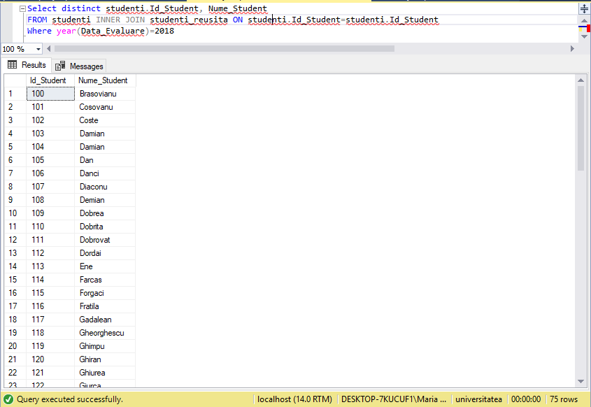

# Laborator 4


# Interogarea nr8.
```
Select distinct studenti.Id_Student, Nume_Student
FROM studenti INNER JOIN studenti_reusita ON studenti.Id_Student=studenti.Id_Student
Where year(Data_Evaluare)=2018
```

Obtineti identificatorii si numele studentilor, ale examenelor sustinute in anul 2018. 




# Interogarea nr14
    Select Nume_Student, Prenume_Student, Disciplina, Nota
    FROM studenti 
    INNER JOIN studenti_reusita ON studenti.Id_Student=studenti.Id_Student
    INNER JOIN discipline ON studenti_reusita.Id_Disciplina=discipline.Id_Disciplina
    Where Nota>8

Aflati numele si prenumele studentilor, precum si cursurile promovate cu note mai mari de 8 la
examen. 


# Interogarea nr29

Determinati numele si prenumele studentilor, care au sustinut examene cu o nota mai mica decat
oricare dintre notele studentilor cu identificatorul l 00.


